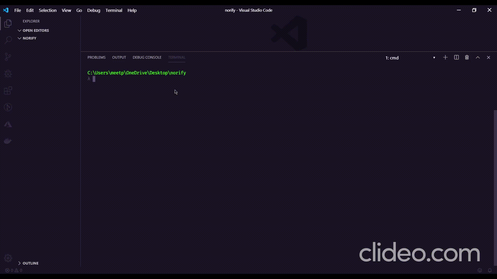

## 🚀 Get Up and Running in few seconds


---

1. **Install the norify.**

    ```shell
    npm install -g norify
    ```

2. **Create a NodeJS API starter from CLI.**

    ```shell
    # create a new starter
    norify
    ```
## :memo: License

Licensed under the [MIT License](./LICENSE).