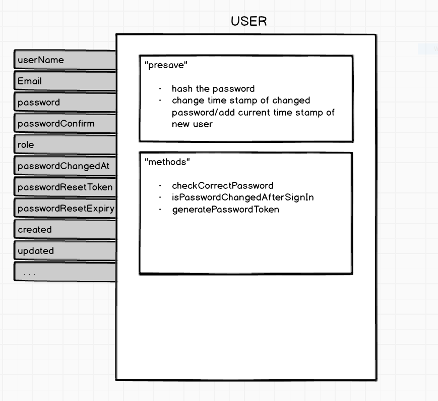
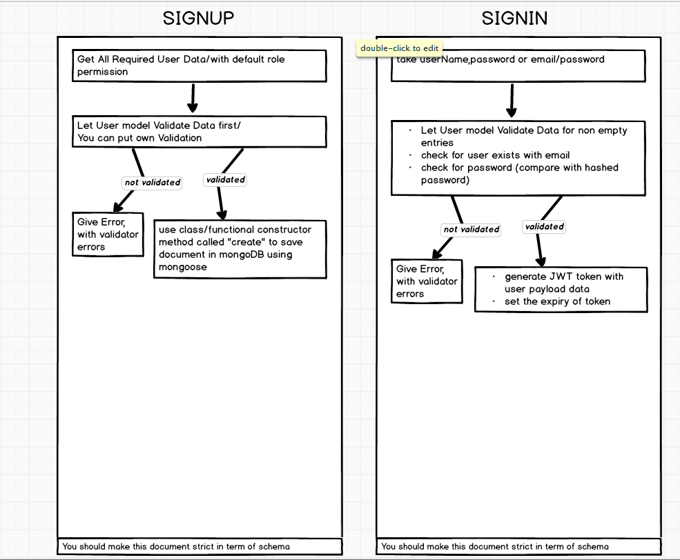
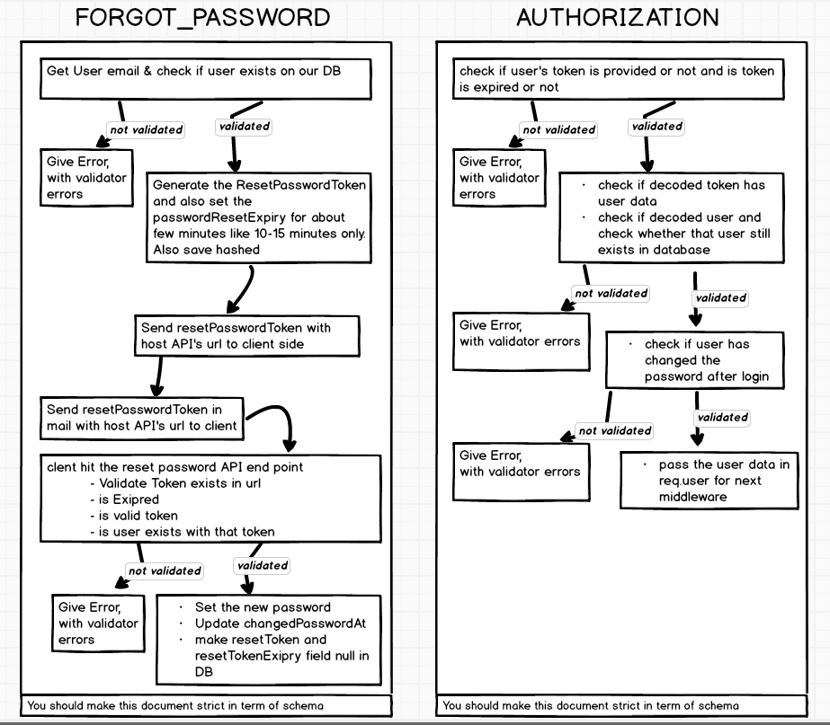

## 🚀 Get Up and Running in few seconds


---

1. **Install the norify.**

    ```shell
    npm install -g norify
    ```

2. **Create a NodeJS API starter from CLI.**

    ```shell
    # create a new starter
    norify
    ```
3. **Go Inside Generated Project.**

    ```shell
    cd ./geneatedProject
    ```
4. **Add Values Inside ENV Variables.**

5. **Start Server.**

    ```shell
    npm start
    ```


<h4 align="left"> ️🤝 Implemented / Ongoing (PR welcome) 🤝 </h4>

|                Feature                            |  🔰      Done        | 
| ------------------------------------------------- |  :----------------   | 
| ES6+ with Babel Node                              |         ✔️         |
| ENV                                               |         ✔️         |
| Live reload (nodemon + babel)                     |         ✔️         |
| Role Based Authentication                         |         ✔️         |
| Mongoose and CRUD                                 |         ✔️         |
| Scalable Database Schema                          |         ✔️         |
| Mongoose Debug                                    |         ✔️         |
| Forgot Password                                   |         ✔️         |
| Mail Send                                         |         ✔️         |
| Global Error Catch                                |         ✔️         |
| Sorting                                           |         ✔️         |
| Limit fields                                      |         ✔️         |
| Pagination                                        |         ✔️         |
| File Upload (using Object storage)                |         ❌         |
| Image Processing (using web worker)               |         ❌         |
| Streaming of file                                 |         ❌         |
| Socket.io                                         |         ❌         |
| PM2 ready deployment                              |         ❌         |
| GraphQL Version                                   |         ❌         |

## Authentication Explaination

<p align="center">User Schema</p>
<p align="center"></p>

<p align="center">SignUp and SignIn</p>
<p align="center"></p>

<p align="center">Forgot Password & Authorization</p>
<p align="center"></p>

## :memo: License

Licensed under the [MIT License](./LICENSE).
